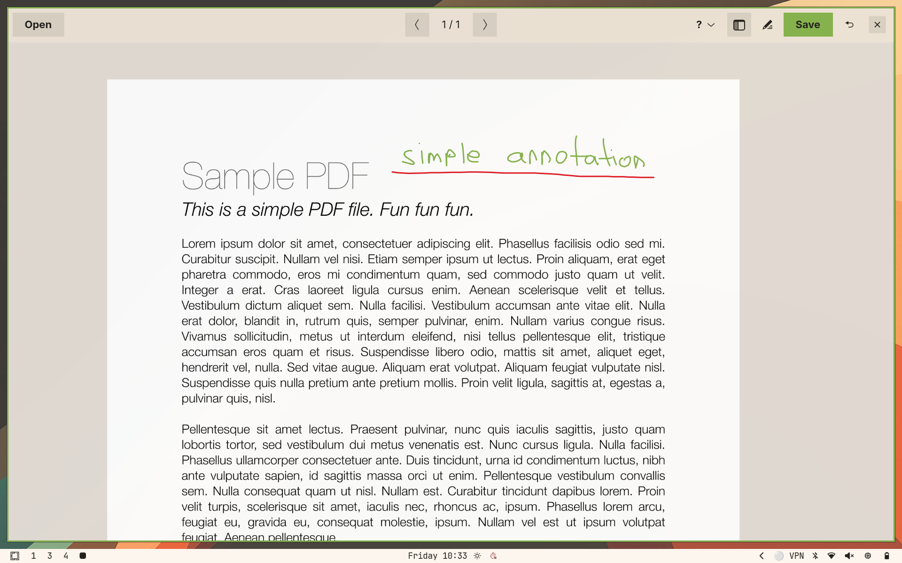

# Sidemark

[](https://aur.archlinux.org/packages/sidemark-git)
[](https://github.com/brokkoli71/sidemark/actions/workflows/ci.yml)

Sidemark is a lightweight PDF annotator for Linux with a live Markdown notes panel. Open a PDF — lecture slides, papers, or any document — draw directly on it, and write structured notes beside it.



> If Sidemark is useful to you, please ⭐ [star it on GitHub](https://github.com/brokkoli71/sidemark) and 🗳️ [vote for it on the AUR](https://aur.archlinux.org/packages/sidemark-git) — it's the main way other people discover the project.

## Why Sidemark

Sidemark was built for taking lecture notes. It works with two plain files and nothing else: your document stays a `.pdf` and your notes are a `.md` sidecar you can open in any editor. Annotations are written straight back into the PDF as native ink, so what you draw and write stays in formats you already use everywhere.

- **Just PDF and Markdown** — strokes save as native PDF ink annotations; notes save as a standard `.md` sidecar that's Obsidian-compatible and readable anywhere
- **Markdown notes built for lectures** — a full Markdown editor sits beside the page, scoped to whichever page you're on, with fast inline math for the things that actually come up in a lecture: indices, exponents, and Greek letters (`x^2`, `\alpha`, `\sum` …)
- **Open PowerPoints directly — and present on them** — drop a `.pptx` in and it's converted to PDF automatically, with each slide's **speaker notes imported into the notes sidebar** (one slide → one page) so your talking points come along; presenter view (`F5`) mirrors the current slide to a second screen and shows your ink live, so you can draw on the slides while you teach
- **Anchor notes to the page** — `Ctrl+Alt+click` drops a numbered marker that links an exact spot on the PDF to the matching paragraph in your notes; callouts render the note right on the page with an arrow
- **Rearrange pages by drag-and-drop** — reorder, import, and export pages from the thumbnail sidebar by dragging (drag pages out to a file manager to export, drop a PDF in to insert), inspired by Apple's Preview
- **GoodNotes-style lasso** — loop around existing ink to select it, then drag to move, recolour, or delete it as a single undo step

## Features

### Annotations

- **Draw** with a configurable pen — strokes are saved as native PDF ink annotations and are individually erasable by right-click-dragging
- **Straight-line snap** — hold still mid-stroke to lock to a straight line; move while holding to aim, release to commit
- **Highlighter** (`Ctrl+H`) — wide translucent strokes with their own color and width setting, preserved across save/reload like any annotation. Long-press the highlighter tool to switch from free-hand to **mark text**, where a drag selects words (reading order) and lays a clean highlight band over each line — still stored as ink, so it erases and undoes like any stroke
- **Lasso ink** (lasso tool, or `Ctrl+Shift+Alt+drag`) — draw a freehand loop around existing strokes to select them (any stroke touching the loop is caught, GoodNotes-style), then drag the selection to **move** it, press `Delete` to remove it, or pick a new colour/width in the pen settings to **recolour** it. `Escape` clears the selection; every action is a single undo step
- **Undo / redo** (`Ctrl+Z` / `Ctrl+Y`) — works across both the canvas and notes; undo a stroke, an erase, or a burst of typing in the order you made them

### Notes

- **Live Markdown** with syntax highlighting, inline math (`x^2`, `\alpha`, `\sum`, `\mapsto` …), and formatting shortcuts (`Ctrl+B`, `Ctrl+I`, `Ctrl+E`). Symbols are rendered for display only — the `.md` file always keeps the source `\commands`, so notes round-trip cleanly through other editors
- **Anchor markers** (`Ctrl+Alt+click`) — numbered circles placed on the PDF that link to the corresponding paragraph in your notes
- **Callout boxes** (`Ctrl+Alt+drag`) — anchor plus a box rendered on the PDF at the drag endpoint, with an arrow from the anchor; both the anchor and the box can be dragged to reposition (the arrow re-aims itself); included in exports. The box renders the note's symbols (`\alpha`→α), super/subscripts (`x^2`, `a_{ij}`) and inline Markdown (`**bold**`, `*italic*`, `` `code` ``) — always, regardless of which notes line is selected
- **Standalone text boxes** (`Ctrl+Alt+right-click`) — drop a box of text directly on the page with no anchor or arrow; edit it in the notes panel (it's a `<!-- textbox:X:Y -->` paragraph in the `.md`), drag it to reposition, and it renders the same symbols / super-subscripts / Markdown as callouts; included in exports
- **Date / time snippets** — type `/date`, `/time`, or `/now` then Space to expand
- **Choose where notes live** — by default each PDF gets a `<filename>-notes.md` sidecar, created only once you actually write something (a PDF you never annotate stays clutter-free, and its notes panel opens collapsed). Pick **Notes file…** from the ☰ menu to point a document at a different Markdown file — handy for sharing one notes file across several PDFs; the choice is remembered per PDF

### Navigation

- **Pan & zoom** — scroll to pan, `Ctrl+scroll` or pinch to zoom (centered on the cursor), `Shift+drag` to zoom to region, `Shift+click` to fit page
- **Page flip** — `PageDown` / `PageUp` or mouse thumb buttons; scrolling past a page edge flips automatically. At the very first and last page, scrolling stops at the boundary instead of drifting into empty space (drag-pan still moves freely)
- **Follow links** — `Alt+click` a footnote, citation, or cross-reference to jump to its target (scrolling to the exact spot, even on the same page); `Alt+Left` jumps back to where you were reading. External URLs open in your browser
- **Outline & thumbnails** — `Ctrl+T` toggles a sidebar between the PDF's table of contents and page thumbnails; drag a thumbnail to reorder pages, drop a PDF **from a file manager** between thumbnails to insert its pages there, or drag one (or several — `Ctrl+click` thumbnails to add or remove pages from the selection) **out to a file manager or the desktop** to export those pages as a standalone PDF — annotations baked in, and any page's notes appended after it, like macOS Preview. A drop line shows where pages will land, and a confirmation dialog (with a "don't ask again" option) guards reorders and inserts. Hover any sidebar item to see what it does and its shortcuts
- **Add / delete pages** — insert blank pages with the same dimensions as the current page
- **Presenter view** (`F5`) — mirror the current page on a second screen for presenting: it goes fullscreen on the other monitor (windowed if you only have one), with no header or notes — just the page and its live ink. It follows your page changes and shows strokes as you draw them, but keeps its own fit-to-page view, so you can zoom in to edit a slide while the audience still sees it whole. `Esc` (or `F5` again) closes it

### Files & integration

- **Formats** — opens `.pdf`, `.pptx` (auto-converted via LibreOffice), and `.md` files; drag a file from your file manager onto the window. Any other file opens as text in the notes panel — handy for `.txt`, code, or config files — with a warning to confirm first if it looks binary, isn't valid UTF-8, or is very large
- **OCR for scans** — open a scanned PDF with no text layer and Sidemark offers to **add a searchable text layer** so you can select, copy, and find its text (and anchor notes to it). It runs in the background and reopens the searchable result; you can also trigger it on demand from **Add text layer (OCR)** in the ☰ menu. Needs the optional [`ocrmypdf`](https://ocrmypdf.readthedocs.io) tool — `./install.sh` offers to install it (or `./install.sh --with-ocr`); on Arch it lives in the AUR (`yay -S ocrmypdf`, plus `pacman -S tesseract-data-eng`)
- **Share to phone** — **Share to phone…** in the ☰ menu shows a QR code (and link) that opens the current PDF in your phone's browser. It shares the **exported** version, so your notes, anchors, callouts and text boxes are baked in (grouped notes pages and all). The dialog opens instantly with a spinner while it bakes the PDF and renders the codes in the background. It spins up a one-shot HTTP server serving just that file under a random path, stopped when you close the dialog. The first code is for the **same Wi-Fi**; an **Over Tailscale** code is always shown beside it — a scannable code when [Tailscale](https://tailscale.com) is connected (works from anywhere your phone is on the tailnet), or a hint on how to set it up when it isn't. Tailscale is handy when AP isolation or a Wi-Fi repeater on a different subnet blocks the LAN route. The QR needs the optional [`qrencode`](https://fukuchi.org/works/qrencode/) tool (`pacman -S qrencode`); without it the link is shown as text
- **Tabs** — opening a file from inside a window (`Ctrl+O`, Open recent, `Ctrl+N`, or dropping a file onto the window) opens it in a **new tab** in that window. The tab strip stays **hidden until you have more than one document open**, so a single PDF costs no vertical space and the page never moves down; with multiple tabs a full-width strip appears just below the header. `Ctrl+W` closes the current tab (prompting if it has unsaved changes); the window closes when its last tab does. `Ctrl+Shift+T` reopens the most recently closed tab (browser-style). **Drag a tab out** to the desktop to pop it into its own window, or onto another Sidemark window to regroup it side by side. Files opened from outside (file manager, command line) still open in their own window
- **Recent files** — in-app menu, XDG recent-files integration (GTK / GNOME / KDE file dialogs), and an optional walker / Omarchy launcher menu
- **Text selection** — `Alt+drag` selects words and copies to clipboard; `Ctrl+M` switches the primary drag to select mode. Selection defaults to **reading order** — like a normal PDF viewer, it grabs the contiguous run of text between where you press and release (column-aware) — and long-pressing the select tool switches to a **rectangular** marquee for tables and code
- **Design scheme** — inherits accent color and dark / light mode from Omarchy, GNOME, or KDE automatically
- **Tool switch** — a segmented header control selects the active tool: pen, highlighter, eraser, lasso, text-select, pan, zoom-to-region, and anchor. Each tool is just the modifier-free shortcut for a gesture (e.g. the eraser tool makes a left-drag erase, like the always-on right-drag), and holding the matching modifier (`Ctrl` pan · `Alt` select · `Shift` zoom · `Ctrl+Shift` highlighter · `Ctrl+Alt` anchor · `Ctrl+Shift+Alt` lasso) lights up its button — so the hidden gesture shortcuts are discoverable
- **Responsive header** — a compact single-row toolbar (file actions live in the ☰ menu); as the window narrows it measures itself and folds progressively — first the tool switch tucks into the pen-settings popover, then undo / redo / find drop away — so the core controls stay reachable at any width

## Installation

### AUR (Arch Linux / Omarchy)

```bash
yay -S sidemark-git
```

### install.sh (any Linux)

```bash
git clone https://github.com/brokkoli71/sidemark
cd sidemark
./install.sh
```

Installs the app, creates a launcher entry, registers it as the default handler for PDF and Markdown files, and installs bash tab-completion for the `sidemark` command. If OCR support isn't already present it offers to install it (see below). Run `./install.sh --help` for all flags; the main ones are `--with-ocr` (install OCR support for scanned PDFs without prompting), `--walker-menu` (launcher recent-files menu, see below) and `--register-pptx` (also become the default handler for PowerPoint files, which open via LibreOffice conversion).

```bash
./install.sh --uninstall
```

### Command line

```bash
sidemark [OPTIONS] [FILE]      # FILE: a .pdf, .pptx, .md, or text file
sidemark --help                # full option list
sidemark --page 5 lecture.pdf  # open at a given page
```

Tab-completion for the `sidemark` command's options and files is installed automatically (start a new shell to pick it up). To complete `./install.sh`'s own flags, `source extras/install.sh.bash` from the repo (both work in zsh after `autoload -U +X bashcompinit && bashcompinit`).

### Run directly (no install)

```bash
git clone https://github.com/brokkoli71/sidemark
cd sidemark
python sidemark.py [file.pdf]
# Add -v / --verbose for debug logging
```

**Dependencies:**

Arch / EndeavourOS:
```bash
sudo pacman -S python python-gobject gtk4 libadwaita python-pymupdf python-numpy python-cairo gtksourceview5
```

Ubuntu / Debian:
```bash
sudo apt install python3 python3-gi python3-gi-cairo python3-numpy \
  gir1.2-gtk-4.0 gir1.2-adw-1 gir1.2-gtksource-5 \
  libgtk-4-1 libadwaita-1-0 libgtksourceview-5-0
pip install pymupdf
```

## Shortcuts

### Annotation

| Input | Action |
|-------|--------|
| Left-drag | Draw stroke |
| Hold still mid-stroke | Snaps the stroke to a straight line (GoodNotes-style) — keep holding and move to aim it, release to commit |
| Right-drag | Erase stroke (including from previous sessions) |
| `Ctrl+H` | Toggle highlighter — wide translucent strokes, own color/width in pen settings |
| `Ctrl+Shift+drag` | Draw one highlighter stroke without switching tool (reverts on release) |
| Lasso tool / `Ctrl+Shift+Alt+drag` | Loop around strokes to select them, then drag to move · `Delete` to remove · change colour/width to recolour · `Escape` to clear |
| `Ctrl+Z` | Undo the last action — a stroke, an erase, or a burst of typing — works across drawing and notes regardless of where the cursor is |
| `Ctrl+Y` / `Ctrl+Shift+Z` | Redo the last undone action |
| `Ctrl+M` | Toggle draw / select-text mode — in select mode a plain left-drag highlights text instead of drawing (the cursor changes to indicate the active mode) |
| `Alt+drag` | Select & copy text (snaps to whole words) — works in either mode |
| Long-press select tool | Switch text selection between reading-order (default) and rectangular |
| Long-press highlighter tool | Switch highlighter between free-hand (default) and mark-text (drag over words to highlight whole lines) |

### Pages

| Key | Action |
|-----|--------|
| `PageDown` | Next page (keeps current zoom) |
| `PageUp` | Previous page (keeps current zoom) |
| `Alt+click` | Follow the link under the cursor — a footnote, citation, or cross-reference jumps to its target (URLs open in your browser) |
| `Alt+Left` | Jump back to where you were before following a link |
| `Ctrl+Shift+N` | Add blank page after current |
| `Ctrl+Shift+Delete` | Delete current page |
| `F5` | Toggle presenter view — mirror the page fullscreen on a second screen (`Esc` to close) |
| `Ctrl+T` | Toggle outline / page-thumbnail sidebar (Outline ⇄ Pages switcher when the PDF has both) |
| Click / `Ctrl+click` thumbnail | Click selects a single page; `Ctrl+click` adds or removes a page from the multi-page selection |
| Drag thumbnail → thumbnail | Reorder pages (in the page-thumbnail sidebar) |
| Drop a PDF → between thumbnails | Insert that PDF's pages at the drop point (a drop line shows where) |
| Drag thumbnail(s) → file manager / desktop | Export the dragged page(s) as a standalone PDF (notes appended), like macOS Preview |

### Zoom & pan

| Input | Action |
|-------|--------|
| Two-finger drag (touchpad) / scroll wheel | Pan — a touchpad pans smoothly in any direction (no axis lock) |
| Scroll past page edge | Flip to next / previous page (keeps zoom) |
| `Ctrl+scroll` | Zoom in/out (centered on the cursor) |
| Pinch (two-finger) | Zoom and pan together — the points under your fingers stay fixed on the page |
| `Ctrl+drag` / Middle-drag | Pan |
| Mouse thumb button (hold) | Pan by moving the mouse; scroll while holding to zoom |
| `Shift+drag` | Zoom to region |
| `Shift+click` | Fit page |

### Notes

| Key | Action |
|-----|--------|
| `Ctrl+B` | Bold selection |
| `Ctrl+I` | Italic selection |
| `Ctrl+E` | Inline code selection |
| `Ctrl+D` | Duplicate the current line (or every line the selection spans) |
| `Alt+↑` / `Alt+↓` | Move the current line (or selected lines) up / down |
| `/date` `/time` `/now` | Type the snippet then Space/Enter — expands to today's date, the time, or both |
| `Ctrl+\` | Toggle notes panel |
| `Ctrl+Alt+click` | Place a numbered anchor on the PDF, linked to the note paragraph at the current cursor position |
| Drag an anchor | Move a placed anchor to a new spot (a click without dragging still jumps to its note) |
| Drag a callout box | Move a placed callout box to a new spot — the arrow re-aims from its anchor automatically |
| `Ctrl+Alt+drag` | Place an anchor **and** a callout box at the drag end — the anchor's note paragraph is rendered on the PDF with an arrow pointing from the anchor |
| `Ctrl+Alt+right-click` | Drop a **standalone text box** on the page (no anchor) — type into the placeholder in the notes panel; drag the box to reposition |

### Inline math (notes)

Renders automatically on lines where the cursor isn't; move the cursor to a line to edit the raw syntax.

| Syntax | Renders as |
|--------|-----------|
| `x^2` or `x^{n+1}` | superscript (until next space, or braced) |
| `x_ij` or `x_{i,j}` | subscript (until next space, or braced) |
| `\alpha` `\beta` … `\omega` | Greek letters (α β … ω) |
| `\sum` `\prod` `\int` | Σ Π ∫ |
| `\infty` `\approx` `\neq` `\leq` `\geq` | ∞ ≈ ≠ ≤ ≥ |
| `\in` `\notin` `\subset` `\cup` `\cap` `\emptyset` | ∈ ∉ ⊂ ∪ ∩ ∅ |
| `\forall` `\exists` `\partial` `\nabla` `\to` | ∀ ∃ ∂ ∇ → |

Stored as plain text in the `.md` sidecar — renders cleanly in Obsidian and any Markdown viewer.

### Search

| Key | Action |
|-----|--------|
| `Ctrl+F` | Open search bar (searches the PDF text **and** the Markdown notes) |
| `Enter` / `↓` | Next match |
| `↑` | Previous match |
| `Escape` | Close search |

### File

| Key | Action |
|-----|--------|
| `Ctrl+O` | Open file (in a new tab) |
| `Ctrl+N` | New blank PDF (in a new tab) |
| `Ctrl+S` | Save (prompts for name if untitled) |
| `Ctrl+W` | Close the current tab (prompts to save unsaved changes; closes the window with the last tab) |
| `Ctrl+Shift+T` | Reopen the most recently closed tab |

PDF-level shortcuts — `PageUp` / `PageDown` (page flip), `Ctrl+\` (toggle notes), `Ctrl+W` (close tab), `Ctrl+Shift+T` (reopen closed tab) — work no matter which side has focus, so flipping pages while typing notes works as expected.

## Tested distributions

| Distro | Unit tests | Install |
|--------|-----------|---------|
| Arch Linux | ✓ | ✓ CI |
| Ubuntu 24.04 | ✓ CI | ✓ CI |
| Fedora 41 | | ✓ CI |

"✓ CI" = verified on every push via GitHub Actions. Arch unit tests run locally (Omarchy is the primary development environment).

## Autosave

While there are unsaved changes, Sidemark snapshots the document and notes every 60 seconds to `~/.local/state/sidemark/autosave/` — the original file is never modified until you explicitly save. If Sidemark closes uncleanly, reopening the file offers to recover the snapshot. Snapshots are removed on save or discard, and pruned after 30 days.

## Recent files

Opened and saved files are tracked in `~/.local/share/sidemark/recent.json` (newest first, 15 entries) and accessible three ways:

- **In-app** — the clock-arrow button next to *Open* lists them.
- **XDG recent files** — opens are registered in `recently-used.xbel`, so GTK/GNOME file dialogs and KDE (including krunner's recent-documents results) pick them up automatically.
- **walker / Omarchy launcher** (opt-in) — `./install.sh --walker-menu` drops `extras/sidemark_recent.lua` into `~/.config/elephant/menus/` (needs `jq`). Reach it via walker's provider list (`/` by default), or bind a prefix in `~/.config/walker/config.toml`:

  ```toml
  [[providers.prefixes]]
  prefix = "p:"
  provider = "menus:sidemarkrecent"
  ```

For other launchers (rofi, fuzzel, …) `sidemark --list-recent` prints `name<TAB>path` lines and exits — useful for scripting or building your own menu.

## Notes format

Notes are saved alongside the PDF as `<filename>-notes.md` (or a custom file you pick via **Notes file…**, remembered per PDF; the file is created lazily, only once you write something) using invisible `<!-- page:N -->` markers, so the file renders cleanly in any Markdown viewer or Obsidian vault. Anchor markers (`<!-- anchor:X:Y -->`) and callout markers (`<!-- callout:X:Y -->`) are stored the same way — invisible in external viewers. Inside Sidemark, anchors appear as numbered circles on the PDF canvas; a callout additionally renders its anchor's note paragraph in a box at the callout position, with an arrow from the anchor. Callouts are included in exports.

When you **export with notes** (☰ menu), every page keeps its on-page marks (text boxes, callout boxes and numbered anchor circles), and a *notes page* carries only what isn't already on the page: callout and text-box text is skipped (it's drawn in place) and empty anchors are skipped too (only their circle is drawn), so you don't get the same text twice. Anchor notes are listed with their `[N]` number. By default short notes from several pages are **grouped** onto shared notes pages, each section labelled with the page it came from; untick *Group small notes together* in the export dialog to get one notes page per annotated page instead, or tick *Include pages with no notes* to add a notes page for every page.
